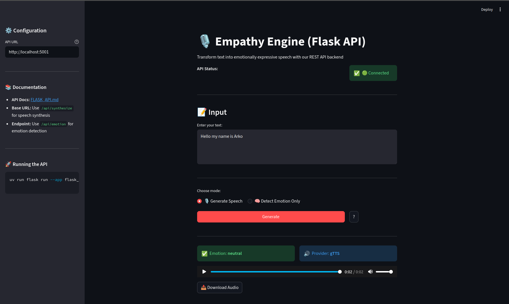

# 🎙️ Empathy Engine: Emotion-Aware Text-to-Speech System

## 🚀 Overview

**Empathy Engine** is an AI-powered system that transforms plain text into **emotionally expressive speech**.
It bridges the gap between **text-based sentiment understanding** and **human-like voice generation**, enabling more natural and engaging AI interactions.

Unlike traditional TTS systems that sound robotic, this system dynamically adjusts voice characteristics such as **pitch, rate, and style** based on the detected emotion of the input text.

---

## 🧠 Key Features

* 🎯 **Emotion Detection (NLP)**

  * Uses transformer-based models to classify text into emotional categories:

    * Positive 😊
    * Negative 😠
    * Neutral 😐

* 🔊 **Dynamic Voice Modulation**

  * Maps emotions to voice parameters (pitch, rate, style)
  * Supports **intensity scaling** (e.g., exclamation marks, capitalization)

* 🎛️ **SSML-Based Speech Control**

  * Uses **Speech Synthesis Markup Language (SSML)** for fine-grained control:

    * Pitch adjustment
    * Speaking rate
    * Natural prosody

* 🔄 **Multi-Provider TTS Architecture**

  * Automatically selects the best available provider:

    ```
    Google TTS (Primary) → ElevenLabs (Secondary) → gTTS (Fallback)
    ```
  * Ensures **robust and fault-tolerant audio generation**

* 🌐 **Interactive Web UI (Streamlit)**

  * Input text → detect emotion → generate audio instantly
  * Displays:

    * Detected emotion
    * TTS provider used
    * Audio playback + download

---

## 📸 Application Interface



*The Streamlit interface showing real-time emotion detection and audio generation with audio playback and download capabilities.*

---

## 🏗️ System Architecture

```
Text Input
   ↓
Emotion Detection (Transformers)
   ↓
Voice Mapping (Emotion → Parameters)
   ↓
SSML Generator
   ↓
TTS Router
   ├── Google Cloud TTS (SSML-based)
   ├── ElevenLabs (expressive backup)
   └── gTTS (fallback)
   ↓
Audio Output (.mp3)
```

---

## 📁 Project Structure

```
EmpathyEngine/
│
├── app/
│   ├── config/
│   │   └── config_loader.py
│   ├── emotion/
│   │   ├── detector.py
│   │   └── labels.py
│   ├── pipeline/
│   │   └── empathy_pipeline.py
│   └── tts/
│       ├── engine.py
│       ├── voice_mapper.py
│       └── ssml_generator.py
│
├── configs/
│   └── config.yaml
│
├── streamlit_app/
│   └── app.py
│
├── outputs/
│   └── audio/
│
├── main.py
└── README.md
```

---

## ⚙️ Setup Instructions

### 1️⃣ Clone Repository

```bash
git clone <your-repo-url>
cd EmpathyEngine
```

---

### 2️⃣ Create Virtual Environment (using uv)

```bash
uv venv
source .venv/bin/activate (ubuntu)
```

---

### 3️⃣ Install Dependencies

```bash
uv sync
```

---

### 4️⃣ Environment Variables

Create a `.env` file:

```env
HF_TOKEN=your_huggingface_token
ELEVEN_LABS=your_elevenlabs_api_key
```

---

### 5️⃣ Google Cloud Setup (IMPORTANT)

* Create a **Service Account**
* Download JSON key
* Set environment variable:

```bash
export GOOGLE_APPLICATION_CREDENTIALS="/path/to/key.json"
```

* Enable:

  * **Cloud Text-to-Speech API**
  * Attach billing (free tier available)

---

## ▶️ Run the Project

### 🔹 CLI Mode

```bash
python main.py
```

---

### 🔹 Web Interface (Streamlit)

```bash
streamlit run streamlit_app/app.py
```

---

### 🔹 Flask REST API

#### Start the Flask API Server

```bash
uv run flask run --app flask_app/app.py --port 5001
```

The Flask API will be available at `http://localhost:5001`

#### API Endpoints

**1. Health Check**
```bash
curl http://localhost:5001/api/health
```

**Response:**
```json
{
  "status": "healthy",
  "timestamp": "2026-04-16T10:30:45.123456"
}
```

---

**2. Synthesize Speech (Generate Audio + Detect Emotion)**
```bash
curl -X POST http://localhost:5001/api/synthesize \
  -H "Content-Type: application/json" \
  -d '{"text": "I am so happy today!"}'
```

**Request Body:**
```json
{
  "text": "Your text here",
  "return_audio": true
}
```

**Response:**
```json
{
  "success": true,
  "emotion": "positive",
  "provider": "google",
  "audio": "base64_encoded_audio_string",
  "timestamp": "2026-04-16T10:30:45.123456"
}
```

---

**3. Emotion Detection Only (No Audio Generation)**
```bash
curl -X POST http://localhost:5001/api/emotion \
  -H "Content-Type: application/json" \
  -d '{"text": "I am so disappointed"}'
```

**Request Body:**
```json
{
  "text": "Your text here"
}
```

**Response:**
```json
{
  "success": true,
  "emotion": "negative",
  "text": "I am so disappointed",
  "timestamp": "2026-04-16T10:30:45.123456"
}
```

---

**4. Get API Documentation**
```bash
curl http://localhost:5001/api/docs
```

---

### 🔹 Streamlit + Flask Integration

#### Start Both Services Together

**Terminal 1 - Start Flask API:**
```bash
flask --app flask_app/app.py run --port 5001
```

**Terminal 2 - Start Streamlit Frontend:**
```bash
streamlit run streamlit_integrated_app.py
```

The Streamlit app will automatically connect to the Flask API at `http://localhost:5001`

#### Features of Integrated Setup

* **Separated Concerns**: API backend (Flask) and UI frontend (Streamlit)
* **Scalability**: Flask API can be deployed independently
* **Real-time Audio Playback**: Embedded audio player to listen to generated speech
* **Emotion Detection**: Visual feedback showing detected emotion with emojis
* **Download Option**: Download generated audio files directly
* **Health Status**: Streamlit shows Flask API connection status

#### Configuration

In `streamlit_integrated_app.py`, the API URL can be customized:

```python
API_BASE_URL = os.getenv("EMPATHY_API_URL", "http://localhost:5001")
```

Or set via environment variable:
```bash
export EMPATHY_API_URL=http://localhost:5001
uv run streamlit run streamlit_integrated_app.py
```

---

## 🧪 Example Inputs

| Input Text                  | Expected Emotion |
| --------------------------- | ---------------- |
| "This is amazing!"          | Positive         |
| "I’m really frustrated"     | Negative         |
| "Your request is processed" | Neutral          |

---

## 🧠 Design Decisions

* **Transformers over rule-based sentiment**

  * Provides better generalization and accuracy

* **SSML over basic parameter tuning**

  * Enables fine-grained and realistic speech control

* **Multi-provider TTS**

  * Avoids API limitations and ensures reliability

* **Config-driven architecture**

  * Easily extendable and maintainable

---

---

## 🧩 Emotion → Voice Mapping Logic

A core component of the Empathy Engine is the transformation of **detected emotion into expressive speech characteristics**. This is achieved through a combination of **rule-based mapping** and **SSML-driven modulation**.

---

### 🎯 1. Emotion Abstraction

The emotion model outputs fine-grained labels such as:

```text
joy, anger, sadness, fear, surprise, neutral
```

These are mapped into **three standardized categories**:

| Model Output                  | Mapped Emotion |
| ----------------------------- | -------------- |
| joy, surprise                 | positive       |
| anger, sadness, fear, disgust | negative       |
| neutral                       | neutral        |

👉 This abstraction simplifies downstream voice control while preserving emotional intent.

---

### 🔊 2. Voice Parameter Mapping

Each emotion is mapped to a set of **speech parameters**:

| Emotion  | Pitch          | Rate          | Style        |
| -------- | -------------- | ------------- | ------------ |
| Positive | Higher (+4st)  | Faster (1.1x) | Expressive   |
| Negative | Lower (-3st)   | Slower (0.9x) | Calm/Serious |
| Neutral  | Balanced (0st) | Normal (1.0x) | Default      |

---

### 🎛️ 3. SSML-Based Modulation

For Google TTS, these parameters are translated into **SSML**:

```xml
<speak>
  <prosody pitch="+4st" rate="1.1">
    This is amazing!
  </prosody>
</speak>
```

👉 This enables:

* Natural prosody
* Fine-grained control over speech delivery
* More human-like expressiveness

---

### ⚡ 4. Intensity Scaling

The system further enhances realism by adjusting intensity based on text cues:

| Input Pattern     | Effect                   |
| ----------------- | ------------------------ |
| "!" (exclamation) | Increases pitch & rate   |
| ALL CAPS text     | Stronger emotional boost |

Example:

```text
"This is amazing!" → slight boost
"THIS IS AMAZING!!!" → strong boost
```

👉 This mimics how humans naturally emphasize speech.

---

### 🔄 5. Provider-Specific Adaptation

Since different TTS providers support different controls:

| Provider   | Parameter Used                             |
| ---------- | ------------------------------------------ |
| Google TTS | SSML (`pitch`, `rate`)                     |
| ElevenLabs | API params (`style`, `stability`, `speed`) |
| gTTS       | No control (fallback)                      |

👉 The system normalizes parameters internally and adapts them per provider.

---

## ⚠️ Limitations

* Emotion classification is limited to predefined categories
* ElevenLabs free tier may rate-limit requests
* Google TTS requires billing setup (free tier available)
---


### 🧠 6. Design Philosophy

* Keep mapping **simple but extensible**
* Use **interpretable rules** instead of black-box control
* Ensure **cross-provider compatibility**
* Balance **realism vs robustness**

---

### 🚀 Result

This layered approach enables:

```text
Text → Emotion → Parameter Mapping → SSML → Expressive Speech
```

👉 Producing speech that is:

* Context-aware
* Emotionally aligned
* More human-like

---


## 🚀 Future Improvements

* 🎚️ Emotion intensity based on model confidence
* 🧠 Multi-label emotion detection (e.g., happy + surprised)
* 📊 Audio waveform visualization

---

## 🏆 Key Highlights

* End-to-end AI pipeline (NLP + TTS)
* Production-grade multi-provider fallback system
* SSML-driven expressive speech synthesis
* Interactive real-time UI

---

## 📌 Tech Stack

* **Python 3.10+**
* **Transformers (Hugging Face)** - Emotion Detection
* **Google Cloud TTS** - Primary Speech Synthesis
* **ElevenLabs API** - Secondary Speech Synthesis
* **gTTS** - Fallback Speech Synthesis
* **Flask** - REST API Backend
* **Streamlit** - Interactive Web UI
* **UV** - Python Package Manager

---

## 👨‍💻 Author

**Arko Bera**
B.Tech Data Science, IIIT Nagpur

---

## ⭐ Acknowledgements

* Hugging Face for transformer models
* Google Cloud for TTS APIs
* ElevenLabs for expressive voice synthesis

---

## 📜 License

This project is for educational and research purposes.
